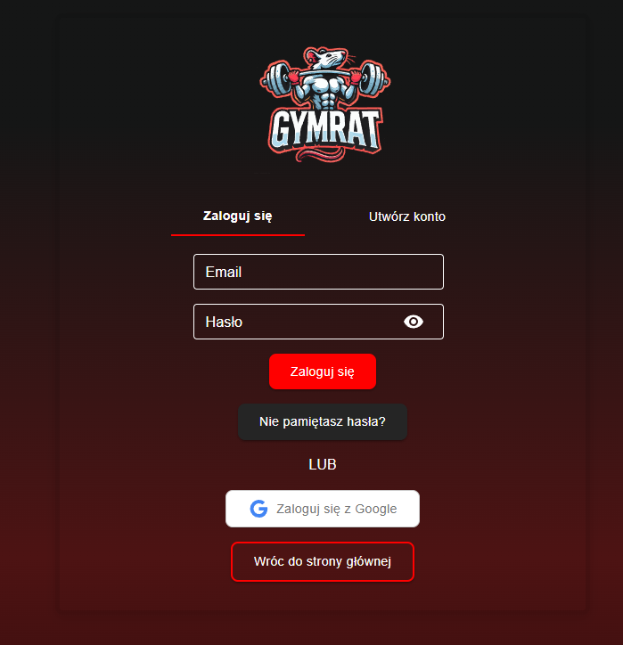
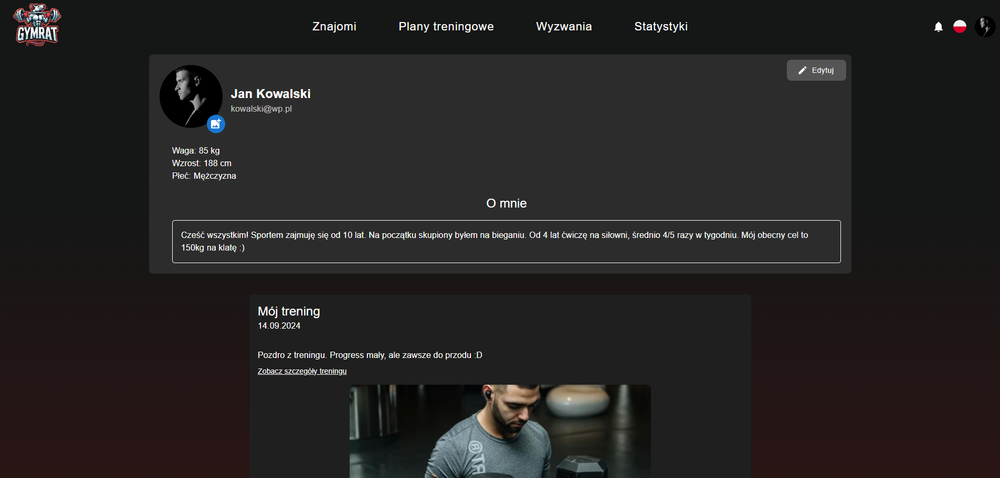
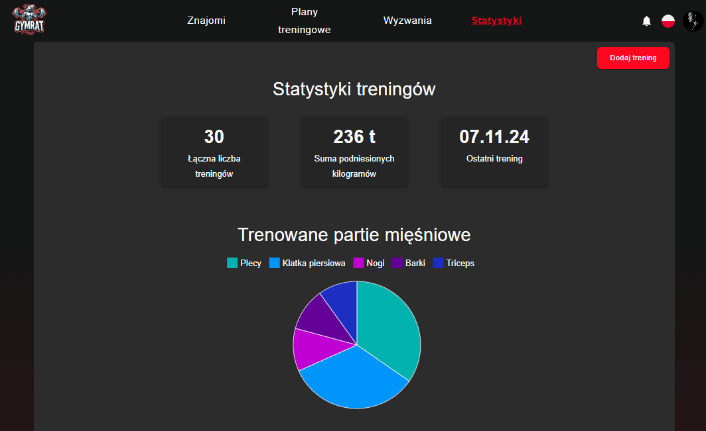
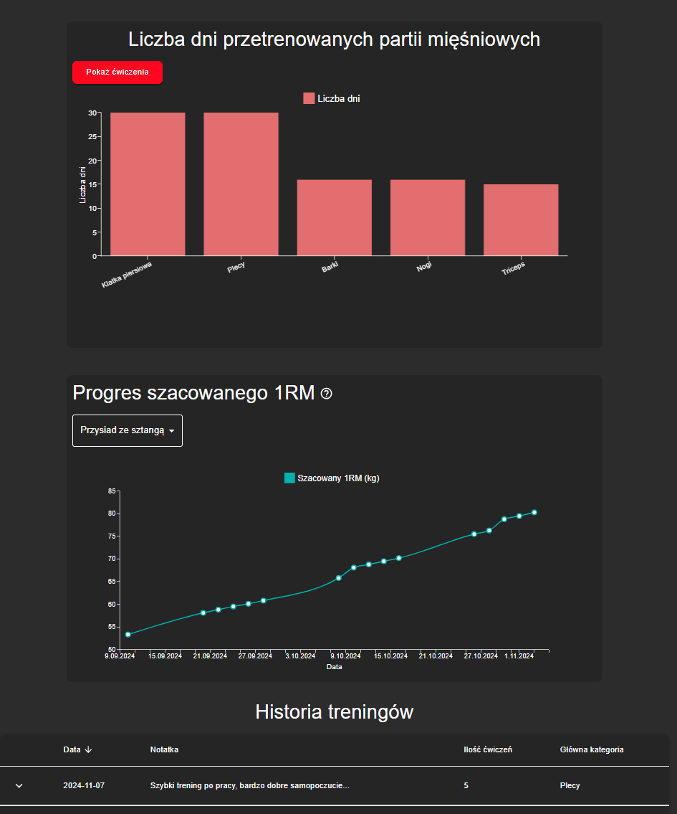
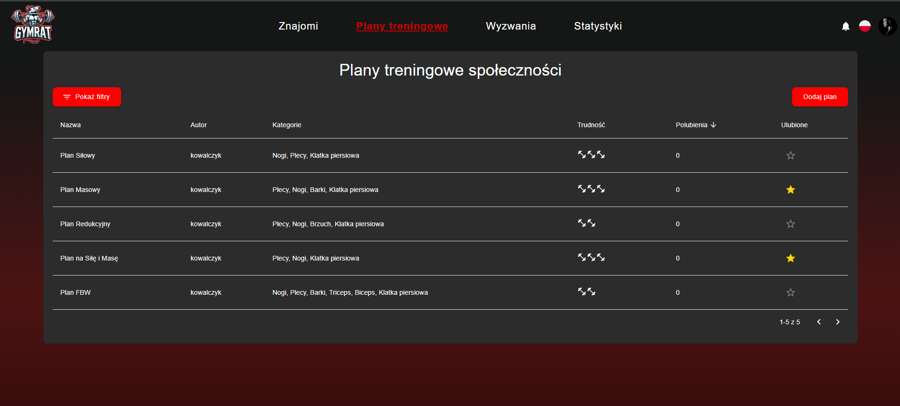
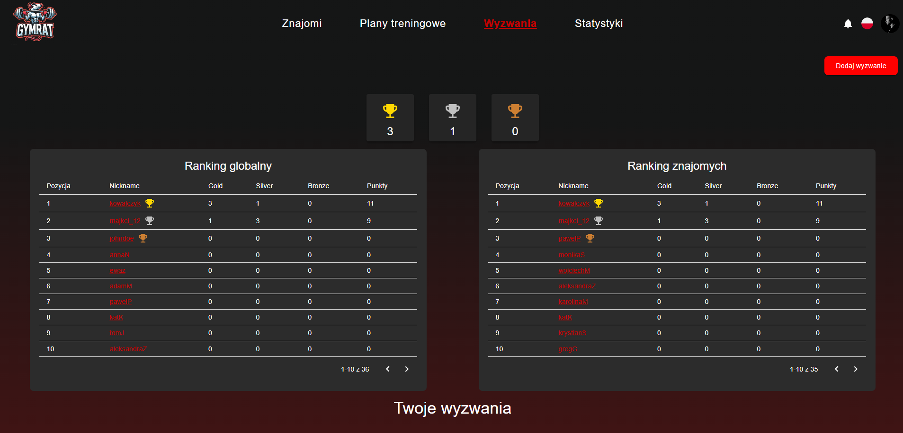

# GymRat 🏋️‍♂️

> Aplikacja internetowa dla osób trenujących na siłowni – do tworzenia planów treningowych, śledzenia postępów, wyzwań treningowych i budowania społeczności.

---

## 🔍 O projekcie

GymRat to webowa aplikacja dla osób, które trenują na siłowni. Można w niej planować sesje treningowe, tworzyć własne plany, śledzić swoje postępy, a także dołączać do wyzwań i dzielić się aktywnością z innymi użytkownikami.

Aplikacja aktualnie działa w języku **polskim**, ale pracuję nad dodaniem wsparcia dla języka **angielskiego**

---

## 🌐 Technologie

**Backend:**
- Java, Spring Boot
- Spring Security, Spring Data JPA, Hibernate
- REST API, WebSocket, JWT, OAuth 2.0 (logowanie przez Google)
- RabbitMQ (obsługa e-maili)
- MySQL

**Frontend:**
- React.js (JavaScript)
- React Router, Context API
- Material UI (MUI)

---

## 🔧 Jak uruchomić projekt

### Backend

1. Przejdź do folderu `gymrat_backend`
2. Skonfiguruj połączenie z bazą danych w pliku `application.yaml`
3. Uruchom aplikację przez IDE (np. IntelliJ) lub w terminalu:
```bash
./mvnw spring-boot:run
```

### Frontend

1. Przejdź do folderu `gymrat_frontend`
2. Zainstaluj zależności:
```bash
npm install
```
3. Uruchom aplikację:
```bash
npm start
```

Po uruchomieniu frontend będzie dostępny pod adresem `http://localhost:3000`

---

## ✨ Funkcjonalości aplikacji

- Rejestracja i logowanie (lokalne oraz przez Google)
- Edycja profilu użytkownika
- Tworzenie i przeglądanie treningów
- Śledzenie historii i postępów (statystyki, wykresy)
- Plany treningowe i ich udostępnianie
- System wyzwań z rankingami i medalami
- Komunikacja w czasie rzeczywistym (czat, powiadomienia)
- Panel administratora do zarządzania treściami i użytkownikami

---

## 📸 Zrzuty ekranu

### Strona główna


### Logowanie


### Profil użytkownika


### Statystyki treningów



### Plany treningowe


### Wyzwania i rankingi


---

## 👤 Autor
**Krzysztof Kaczka**  

- Frontend repo: [gymrat_frontend](https://github.com/Krzychulec21/gymrat_frontend)
- Backend repo: [gymrat_backend](https://github.com/Krzychulec21/gymrat_backend)

